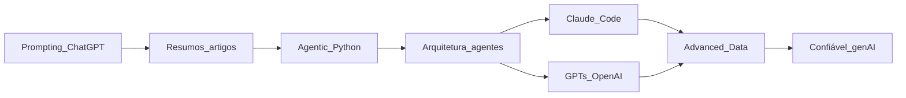

# Índice — AI Agents Development Specialization

Este diretório reúne anotações, resumos de artigos e código de apoio usados no estudo de agentes de IA, prompting e práticas de produto. Use os links abaixo para ir direto ao ficheiro onde cada tema está desenvolvido.

**Convenção:** todos os caminhos são relativos a esta pasta (`AI_Agents_Development_Specialization/`).

**Nota:** a pasta de arquitetura chama-se [`agentic_ai_achitecture`](agentic_ai_achitecture/) no repositório (grafia `achitecture`). Se renomeares no futuro, atualiza os links deste índice.

---

## Sumário

1. [Mapa rápido dos módulos](#mapa-rapido-dos-modulos)
2. [Prompting (ChatGPT)](#prompting-chatgpt)
3. [Resumos de artigos](#resumos-de-artigos)
4. [Agentic AI em Python](#agentic-ai-em-python)
5. [Arquitetura de agentes](#arquitetura-de-agentes)
6. [Claude Code e “AI labor”](#claude-code-e-ai-labor)
7. [GPTs, assistentes e OpenAI](#gpts-assistentes-e-openai)
8. [Advanced Data Analysis](#advanced-data-analysis)
9. [IA generativa confiável](#ia-generativa-confiavel)
10. [Lista de ficheiros (checklist)](#lista-de-ficheiros-checklist)

---

## Mapa rápido dos módulos

---

## 1. Prompting (ChatGPT)

**Ficheiro principal:** [Chatgpt_prompting_module/annotations.txt](Chatgpt_prompting_module/annotations.txt)

**Tópicos:**

- Definições: LLM, prompt; prompts como “resumo de conversa”
- Conceitos: especificidade, persona (“act as”), root prompts, conversa com o modelo para refinar o pedido
- **Padrões de prompt:** Question Refinement, Cognitive Verifier, Audience Persona, Flipped interaction
- **Técnicas:** few-shot, chain-of-thought, ReAct (reasoning + acting)
- Referências a papers (URLs no próprio ficheiro): catálogo de padrões; padrões para código

---

## 2. Resumos de artigos

| Ficheiro | Conteúdo |
|----------|----------|
| [articles_resumes/prompt_catalog.md](articles_resumes/prompt_catalog.md) | Resumo do artigo sobre **catálogo de padrões de prompt**: categorias (semântica de entrada, personalização de saída, erros, melhoria do prompt, controlo de interação), analogia com design patterns |
| [articles_resumes/patterns_for_coding.md](articles_resumes/patterns_for_coding.md) | Resumo do artigo **Prompt Patterns for Software Engineering**: requisitos, design, APIs, qualidade de código, refatoração; prompts como interface do ciclo de vida de software |

---

## 3. Agentic AI em Python

**Anotações:** [agentic_ai_python_module/annotations.txt](agentic_ai_python_module/annotations.txt)

**Tópicos nas anotações:**

- Agentic AI e padrão “flipped” (o modelo pergunta a ti)
- Loop: prompt → resposta → ação → feedback → continuar ou terminar
- Capacidades: prompting programático, gestão de memória
- Parâmetro `messages`: roles `system`, `user`, `assistant`; ausência de memória implícita
- Interface com o ambiente: engenharia de prompt + parsing vs function calling
- Passos do loop: construir prompt, gerar resposta, parse, executar ação, converter resultado, decidir continuação
- Framework **GAIL** (Goals, Actions, Information, Language) e **GAME** (Goals, Actions, Memory, Environment)
- Ferramentas: descrições, nomes, ordem, feedback de resultados e erros
- **AgentLanguage:** construção de prompts e parsing de respostas
- Decorators para manter descrições/schemas alinhados com o código; tags para organização; registo controlado da ferramenta `terminate`
- Reduzir alucinações: pedir perspetivas em vez de uma única “resposta certa”

**Código e configuração:**

| Ficheiro | Para quê |
|----------|----------|
| [agentic_ai_python_module/first_code.py](agentic_ai_python_module/first_code.py) | Exemplo mínimo com LiteLLM (`completion`), mensagens e formato de sistema |
| [agentic_ai_python_module/first_exercise.py](agentic_ai_python_module/first_exercise.py) | Exercício inicial do módulo |
| [agentic_ai_python_module/module2_1.py](agentic_ai_python_module/module2_1.py) | Material do módulo 2 (parte 1) |
| [agentic_ai_python_module/module2_2.py](agentic_ai_python_module/module2_2.py) | Material do módulo 2 (parte 2) |
| [agentic_ai_python_module/inventory_management.py](agentic_ai_python_module/inventory_management.py) | Exemplo / exercício de gestão de inventário |
| [agentic_ai_python_module/requirements.txt](agentic_ai_python_module/requirements.txt) | Dependências Python |
| [agentic_ai_python_module/.env.example](agentic_ai_python_module/.env.example) | Variáveis de ambiente de exemplo (chaves API, etc.) |

**GAME framework (`game_framework/`):**

| Ficheiro | Para quê |
|----------|----------|
| [agentic_ai_python_module/game_framework/core.py](agentic_ai_python_module/game_framework/core.py) | Núcleo do framework de agente / loop |
| [agentic_ai_python_module/game_framework/decorators.py](agentic_ai_python_module/game_framework/decorators.py) | Decorators de ferramentas, schema e registo |
| [agentic_ai_python_module/game_framework/tools.py](agentic_ai_python_module/game_framework/tools.py) | Definições de ferramentas |
| [agentic_ai_python_module/game_framework/agent_module3.py](agentic_ai_python_module/game_framework/agent_module3.py) | Agente (iteração do curso, módulo 3) |
| [agentic_ai_python_module/game_framework/agent_module4.py](agentic_ai_python_module/game_framework/agent_module4.py) | Agente (iteração do curso, módulo 4) |
| [agentic_ai_python_module/game_framework/errors.txt](agentic_ai_python_module/game_framework/errors.txt) | Notas ou listagem de erros relacionados com o framework |

---

## 4. Arquitetura de agentes

Pasta: [`agentic_ai_achitecture/`](agentic_ai_achitecture/) (ver nota no topo sobre o nome.)

**Anotações gerais:** [agentic_ai_achitecture/annotations.txt](agentic_ai_achitecture/annotations.txt)

**Tópicos:**

- Gen AI + prompts como forma de “computação”; agentes auto-prompt com arquitetura modular
- Tipos de ferramentas LLM: transformação, análise, geração, validação, extração; equilíbrio flexibilidade vs fiabilidade na extração
- Caso de uso documentos/e-mail: schemas fixos, validação, prompting focado vs abordagem genérica; abordagem híbrida
- Encapsular complexidade em tools; manutenção, composição, evolução de capacidades
- Multi-agente simples com **persona** (estática vs dinâmica)
- Princípios **MATE** (model, actions, token, environment); segurança do ambiente (ações reversíveis, transações, execução em etapas com revisão, uma tool segura vs várias arriscadas)
- Agentes pequenos vs um agente grande; redução de ruído na memória; IDs de memória e seleção com justificação
- Quatro padrões de partilha de memória entre agentes; padrões de interação (agente único/ReAct, tools, multi-agente, human-in-the-loop, hierárquico)
- Aprendizagem in-context com exemplos de uso de tools; planeamento antecipado + CoT
- **Capability pattern** (cuidado para não repetir lógica dentro do loop); trade-off fluxo rígido vs dinâmico

**Persona (aprofundamento):** [agentic_ai_achitecture/persona_multi_agent_annotations.txt](agentic_ai_achitecture/persona_multi_agent_annotations.txt)

- Persona como bloco de construção; compressão e conhecimento implícito; boas práticas
- Expertise modular; meta-cognição por mudança de papel; static vs dynamic expertise (continuação no ficheiro)

**Código de exemplo:**

| Ficheiro | Para quê |
|----------|----------|
| [agentic_ai_achitecture/capability.py](agentic_ai_achitecture/capability.py) | Ilustração do padrão Capability no loop do agente |
| [agentic_ai_achitecture/invoice_processing_agent.py](agentic_ai_achitecture/invoice_processing_agent.py) | Exemplo de agente de faturas: tools com schema, extração, armazenamento (nota no ficheiro: exemplo do curso, não 100% final) |

---

## 5. Claude Code e “AI labor”

**Anotações:** [claude_code_agents_module/annotations.txt](claude_code_agents_module/annotations.txt)

**Tópicos:**

- “AI labor”: branches isoladas, convenções de nome, pedir compilação/testes antes de entregar
- Contraste entre prompts que só editam um ficheiro vs prompts de “líder” que pedem visão de produto/UX
- Várias soluções (3–5), comparar, escolher ou combinar; avaliação de código em tabela (dimensões de qualidade)
- Sistema **Chat → Craft → Scale**
- Ficheiro **claude.md**: contexto global; framework **CONTEXT**; princípios e anti-padrões
- **Comandos**: contexto por tarefa; framework **TARGETED**; organização por função/domínio/papel
- Exemplos como “modelo” para o modelo seguir; **subagentes** (contexto independente, paralelismo)
- Eficiência de tokens: ficheiros pequenos e estrutura clara; níveis de “extended thinking” (`think`, `think hard`, etc.)

**Exemplos e prompts auxiliares:**

| Ficheiro |
|----------|
| [claude_code_agents_module/claude.md.example](claude_code_agents_module/claude.md.example) |
| [claude_code_agents_module/claude.md.example2](claude_code_agents_module/claude.md.example2) |
| [claude_code_agents_module/claude.md.example3](claude_code_agents_module/claude.md.example3) |
| [claude_code_agents_module/claude.md.example4](claude_code_agents_module/claude.md.example4) |
| [claude_code_agents_module/claude.md.example5](claude_code_agents_module/claude.md.example5) |
| [claude_code_agents_module/claude.md.example6](claude_code_agents_module/claude.md.example6) |
| [claude_code_agents_module/claude-command.md.example](claude_code_agents_module/claude-command.md.example) |
| [claude_code_agents_module/claude-command2.md.example](claude_code_agents_module/claude-command2.md.example) |
| [claude_code_agents_module/my-cloude.md.example](claude_code_agents_module/my-cloude.md.example) |
| [claude_code_agents_module/my-add-feature.md.example](claude_code_agents_module/my-add-feature.md.example) |
| [claude_code_agents_module/n-versions_prompts.txt](claude_code_agents_module/n-versions_prompts.txt) |
| [claude_code_agents_module/expense_track_prompt.txt](claude_code_agents_module/expense_track_prompt.txt) |
| [claude_code_agents_module/code_evalutation_prompt.txt](claude_code_agents_module/code_evalutation_prompt.txt) |

---

## 6. GPTs, assistentes e OpenAI

**Anotações:** [OpenAI_gpts_ai_assistants/annotations.txt](OpenAI_gpts_ai_assistants/annotations.txt)

**Tópicos:**

- Fine-tuning, RAG, MCP; Custom GPTs (instruções + conhecimento + capacidades)
- Persona; benchmarks e rubricas; variar tipos de casos de teste
- Objetivo: ajudar o humano a resolver o problema, não só “dar a resposta”
- Pedir citações literais quando precisas do documento; múltiplas interpretações; secção de contacto
- Limites anti-alucinação; padrões: flipped interaction, refinement, alternativas, cognitive verifier; conflitos entre fontes
- Testes adversariais (reputação, uso público)

**Outros ficheiros:**

| Ficheiro | Conteúdo |
|----------|----------|
| [OpenAI_gpts_ai_assistants/benchmark_design-considerations.txt](OpenAI_gpts_ai_assistants/benchmark_design-considerations.txt) | Cenários “what if”, considerações de desenho de benchmarks para GPTs (serviço ao cliente, receitas, finanças, etc.) |
| [OpenAI_gpts_ai_assistants/capital.txt](OpenAI_gpts_ai_assistants/capital.txt) | Resumo do framework **CAPITAL** para personalizar estilo de comunicação de um GPT (tom, confiança, amicabilidade, etc.) |

---

## 7. Advanced Data Analysis

**Ficheiro:** [advanced_data_analytics/annotations.txt](advanced_data_analytics/annotations.txt)

**Tópicos:**

- Advanced Data Analysis (evolução do “Code Interpreter”) integrado no ChatGPT; ler ficheiros e gráficos
- Quando é adequado (verificação fácil, valor de soluções parciais, apoio à criatividade)
- Casos: vídeo, ZIP, visualizações a partir de dados
- Pipeline **Extract, transform, AI, create**
- Listas extensas de ideias por área (educação, finanças, vendas, marketing, liderança, gestão, …)
- Planeamento com IA: decompor tarefas, refinar planos, executar passo a passo e juntar outputs

---

## 8. IA generativa confiável

**Ficheiro:** [trustworthy_gen_ai/annotations.txt](trustworthy_gen_ai/annotations.txt)

**Tópicos:**

- Respostas fáceis de verificar; reduzir risco de erro
- **Inteligência aumentada** vs substituição; acrónimo **ACHIEVE**
- Filtragem com rastreabilidade; princípios de uso seguro (subconjunto do input, não decidir acesso externo)
- Padrões: filtro simples, filtro semântico, resumir com citação de IDs
- Ideação com humano no centro; padrões de **navegação** (onde encontrar informação vs gerar dados sensíveis); “navigate instead”
- Cautela quando não há expertise para validar respostas

---

## Lista de ficheiros (checklist)

Referência rápida aos **40** ficheiros sob esta pasta (cada linha é um link).

1. [Chatgpt_prompting_module/annotations.txt](Chatgpt_prompting_module/annotations.txt)
2. [articles_resumes/prompt_catalog.md](articles_resumes/prompt_catalog.md)
3. [articles_resumes/patterns_for_coding.md](articles_resumes/patterns_for_coding.md)
4. [agentic_ai_python_module/annotations.txt](agentic_ai_python_module/annotations.txt)
5. [agentic_ai_python_module/first_code.py](agentic_ai_python_module/first_code.py)
6. [agentic_ai_python_module/first_exercise.py](agentic_ai_python_module/first_exercise.py)
7. [agentic_ai_python_module/module2_1.py](agentic_ai_python_module/module2_1.py)
8. [agentic_ai_python_module/module2_2.py](agentic_ai_python_module/module2_2.py)
9. [agentic_ai_python_module/inventory_management.py](agentic_ai_python_module/inventory_management.py)
10. [agentic_ai_python_module/requirements.txt](agentic_ai_python_module/requirements.txt)
11. [agentic_ai_python_module/.env.example](agentic_ai_python_module/.env.example)
12. [agentic_ai_python_module/game_framework/core.py](agentic_ai_python_module/game_framework/core.py)
13. [agentic_ai_python_module/game_framework/decorators.py](agentic_ai_python_module/game_framework/decorators.py)
14. [agentic_ai_python_module/game_framework/tools.py](agentic_ai_python_module/game_framework/tools.py)
15. [agentic_ai_python_module/game_framework/agent_module3.py](agentic_ai_python_module/game_framework/agent_module3.py)
16. [agentic_ai_python_module/game_framework/agent_module4.py](agentic_ai_python_module/game_framework/agent_module4.py)
17. [agentic_ai_python_module/game_framework/errors.txt](agentic_ai_python_module/game_framework/errors.txt)
18. [agentic_ai_achitecture/annotations.txt](agentic_ai_achitecture/annotations.txt)
19. [agentic_ai_achitecture/persona_multi_agent_annotations.txt](agentic_ai_achitecture/persona_multi_agent_annotations.txt)
20. [agentic_ai_achitecture/capability.py](agentic_ai_achitecture/capability.py)
21. [agentic_ai_achitecture/invoice_processing_agent.py](agentic_ai_achitecture/invoice_processing_agent.py)
22. [claude_code_agents_module/annotations.txt](claude_code_agents_module/annotations.txt)
23. [claude_code_agents_module/claude.md.example](claude_code_agents_module/claude.md.example)
24. [claude_code_agents_module/claude.md.example2](claude_code_agents_module/claude.md.example2)
25. [claude_code_agents_module/claude.md.example3](claude_code_agents_module/claude.md.example3)
26. [claude_code_agents_module/claude.md.example4](claude_code_agents_module/claude.md.example4)
27. [claude_code_agents_module/claude.md.example5](claude_code_agents_module/claude.md.example5)
28. [claude_code_agents_module/claude.md.example6](claude_code_agents_module/claude.md.example6)
29. [claude_code_agents_module/claude-command.md.example](claude_code_agents_module/claude-command.md.example)
30. [claude_code_agents_module/claude-command2.md.example](claude_code_agents_module/claude-command2.md.example)
31. [claude_code_agents_module/my-cloude.md.example](claude_code_agents_module/my-cloude.md.example)
32. [claude_code_agents_module/my-add-feature.md.example](claude_code_agents_module/my-add-feature.md.example)
33. [claude_code_agents_module/n-versions_prompts.txt](claude_code_agents_module/n-versions_prompts.txt)
34. [claude_code_agents_module/expense_track_prompt.txt](claude_code_agents_module/expense_track_prompt.txt)
35. [claude_code_agents_module/code_evalutation_prompt.txt](claude_code_agents_module/code_evalutation_prompt.txt)
36. [OpenAI_gpts_ai_assistants/annotations.txt](OpenAI_gpts_ai_assistants/annotations.txt)
37. [OpenAI_gpts_ai_assistants/benchmark_design-considerations.txt](OpenAI_gpts_ai_assistants/benchmark_design-considerations.txt)
38. [OpenAI_gpts_ai_assistants/capital.txt](OpenAI_gpts_ai_assistants/capital.txt)
39. [advanced_data_analytics/annotations.txt](advanced_data_analytics/annotations.txt)
40. [trustworthy_gen_ai/annotations.txt](trustworthy_gen_ai/annotations.txt)
